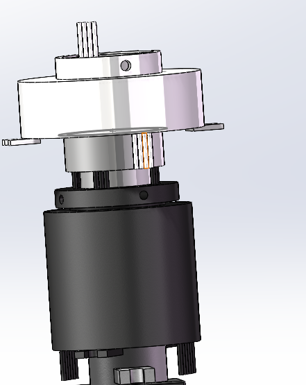

# AT Infantry


RoboMaster 步兵项目代码仓库，当前仓库包含云台与底盘两套主控程序，面向 2026 赛季麦轮伸缩狗腿步兵平台。

## 项目概述

仓库按整车功能拆分为两部分：

- `Flex_Gimbal`：云台控制程序，基于 `STM32F407`
- `Flex_Chassis`：底盘控制程序，基于 `STM32H723`

两部分均使用 STM32CubeMX 工程结构，并集成 FreeRTOS 任务调度。现有代码已经覆盖 IMU、遥控/串口通信、电机控制、上下板通信、部分自瞄链路与设备看门狗等核心功能。

## 仓库结构

```text
Infantry_Flex
|-- docs/                  项目图片与结构示意
|-- Flex_Gimbal/           云台工程（STM32F407）
|-- Flex_Chassis/          底盘工程（STM32H723）
`-- README.md
```

### `Flex_Gimbal` 目录说明

- `Src/`：CubeMX 生成的底层初始化与系统入口
- `Agency/`：云台、发射、底盘交互、USB、看门狗等业务逻辑
- `Components/`：算法、IMU、遥控、控制器等公共组件
- `RM_Lib/`：电机、CRC、遥控、串口通信等 RoboMaster 常用库
- `Middlewares/`：USB Device、FreeRTOS 等中间件
- `MDK-ARM/`：Keil 工程文件

### `Flex_Chassis` 目录说明

- `Core/`：CubeMX 生成的底层初始化与系统入口
- `Infantry_ws/task/`：底盘任务、惯导任务、串口任务、蜂鸣器任务
- `Infantry_ws/agency/`：底盘控制与上下板通信逻辑
- `Infantry_ws/devices/`：BMI088、DM 电机、Unitree 设备驱动
- `Infantry_ws/middlewares/`：遥控、referee、watchdog、plotter 等中间层
- `Infantry_ws/Algorithm/`：Mahony、Kalman、PID 等算法模块
- `MDK-ARM/`：Keil 工程文件

## 当前代码功能

### 云台部分

从现有代码可以确认，云台工程已经实现了以下能力：

- BMI088 初始化与姿态数据采集
- FreeRTOS 多任务调度
- 云台初始化归中
- 云台 yaw / pitch 双轴闭环控制
- 普通模式与自瞄模式切换
- USB 收发链路
- 与 MiniPC/视觉侧的数据交互
- 发射机构任务调度
- 与底盘/下板的数据交互
- 设备状态监测与看门狗离线保护

代码中可见的典型模块包括：

- `Agency/Gimbal/`：云台控制主逻辑
- `Agency/Shoot/`：发射机构任务
- `Agency/USB/`：USB IMU 数据发送与视觉数据接收
- `Agency/WatchDog/`：设备在线状态维护与掉线保护

### 底盘部分

从现有代码可以确认，底盘工程已经实现了以下能力：

- BMI088 初始化与 IMU 姿态解算
- FreeRTOS 多任务调度
- 底盘控制任务
- 遥控器 SBUS 接收
- 裁判系统串口接收
- 看门狗在线检测
- 底盘电机控制与 CAN 发送
- 关节/伸缩机构控制基础框架
- 上下板通信
- C++ 组织业务代码

代码中可见的典型任务包括：

- `UART_Task`：负责遥控器、裁判系统通信与设备喂狗
- `INS_Task`：负责 BMI088 数据读取与 Mahony 姿态解算
- `Chassis_Task`：负责底盘决策、控制与电机输出
- `Buzzer_Task`：负责蜂鸣器相关逻辑

## Flex_Gimbal Review

## 开发状态

项目仍在持续开发中，当前仓库更适合作为：

- 赛季开发记录
- 控制框架参考
- 云台/底盘双板通信与任务架构参考

部分工程目录中包含编译产物与第三方库文件，阅读代码时建议优先关注业务目录与任务入口。

## 已完成内容

### 云台

- [x] 云台双轴电机控制
- [x] USB 通信链路接入与优化
- [x] 自瞄相关收发接口接入
- [x] 云台归中与姿态闭环控制
- [x] 看门狗状态管理与异常保护

### 底盘

- [x] 底盘控制框架搭建
- [x] 后腿自主伸缩控制基础框架
- [x] 上下板通信
- [x] IMU 姿态解算
- [x] 代码结构向 C++ 组织迁移

## 待完善项

- [ ] 补充更完整的硬件连接说明
- [ ] 补充编译、烧录、调参说明
- [ ] 补充模块依赖关系与通信协议文档
- [ ] 补充底盘机构与运动学说明
- [ ] 清理不必要的编译产物，进一步优化仓库结构

## 结构示意

### 滑环



下部大滑环为 12 路，当前备注信息包括：

- Mini PC 供电
- Gimbal 供电
- Ammo-Booster 供电
- CAN 通信

## 说明

- 本 README 基于当前仓库中的实际代码结构整理
- `Flex_Gimbal Review` 章节仅基于当前代码静态分析，不代表所有问题都已在实机中复现
- 若后续工程路径或模块划分调整，README 也需要同步更新
